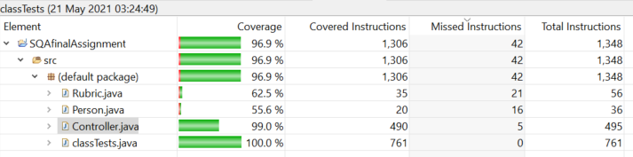
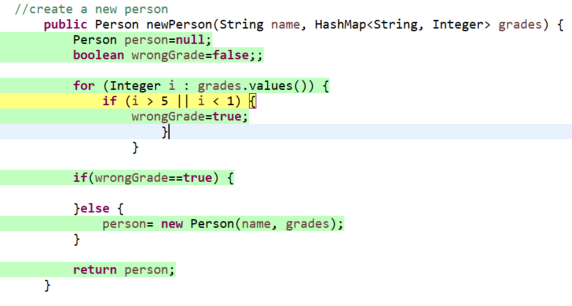
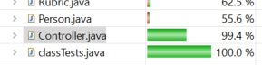

# Software Quality Management Plan

The purpose of this project is to demonstrate the best practices for a software development project. This document should only be used by the team as a reference guide for implementing the best practices during a project. The document will demonstrate the following topics:

- Scrum sprint backlog and task estimation

- Unit testing and Test-Driven development

- Test coverage metric

- Team version-control 

- Code-review checklist

## Scrum sprint backlog and task estimation

#### Sprint backlog
| Task                             				| Estimation    | Priority   |Status   |
| ----------------------------------------------|:-------------:|:----------:|:-------:|
| Create POJO's                    				| 1 			| 1          |Completed|
| Create Controller class          				| 1             | 2          |Completed|
| Investigate and configure test coverage tools | 2             | 3          |Completed|
| Create method to make new rubric 				| 2             | 4          |Completed|
| Create method to get a specific rubric by name| 2 			| 5          |Completed|
| Create method to create new student grade     | 2             | 6          |Completed|
| Create method to add a Criterion to a Rubric  | 2             | 7          |Completed|
| Create method to get a list of all Rubrics    | 2             | 8          |Completed|
| Create method to add a score for a particular criterion to a grade| 2             | 9          |Completed|
| Create method to get all StudentGrades associated with a specific rubric| 2             | 10          |Completed|
| Create method to find average score of all student grades in a rubric| 3             | 11          |Completed|
| Create method to find standard deviation of all student grades in a rubric| 3             | 12          |Completed|
| Create method to find the minimum and maximum scores in a rubric| 3             | 13         |Completed|
| Create method to find average score of all student grades in a specific criterion of a rubric.| 5             | 14         |Completed|
| Create method to find standard deviation of all student grades in a specific criterion of a rubric.|5             | 15      |Completed|
| Create method to find the minimum and maximum scores in a specific criterion of a rubric.| 5             | 16         |Completed|

To estimate the task in the sprint backlog I used story points. This is a popular technique used in agile development
that allows the developers to create an estimation of the difficulty involved in implementing a specific user story.
An estimation is chosen based on different factors that can alter the difficulty such as the complexity of the task,
the effort involved to complete the task and the use of repetition within the task. 

In order to decide the estimations for the corresponding tasks, Fibonacci sequence numbers were used. I used
the Fibonacci sequence as it allows for the estimates to be scaled proportionally as opposed to a linear number scale.
The Fibonacci scale looks like 1,2,3,5,8,13...etc as opposed to a linear scale of 1,2,3,4,5...etc 

When estimating a story point it is good practice to set a baseline for each one. A task with the lowest estimation 
should be set as a baseline, so in my case I used creating the POJOs as a baseline. I set this estimation as a 1 as it 
involves no risk, requires little effort in terms of complexity and is a highly repetitive task. I then based other task 
estimations of this in terms of complexity, repetition and risk required in comparison to the baseline. So for example the 
task 'Create method to make new rubric' was assigned a story point of 2 as I estimate that this involves a bit more effort and complexity and is not a repetitive task compared to creating POJOs. However it is not too difficult and therefore should not be given more than an estimation of 2. 

  
    
  This diagram illustrates the thought process behind assigning estimations to tasks 

#### Calculating velocity
Velocity is a metric used to measure the amount of work a Team can complete during a Sprint. By analyzing the amount of tasks completed in previous sprints, A development team can estimate how much work they can do in future sprint.
 
In order to estimate the Velocity the team should review the previous three sprints. The team should count how many user story points have been completed in each sprint, while disregarding any that may not be completed or partially completed. So for example in my sprint, if the team completed all tasks, a total of 37 story points would have been completed. This process would be completed for three sprints then add the total number of stories and divide it by three to get the average number of story points completed. The team can now plan future sprints around this velocity metric they have calculated. The amount of work in future sprints should be decided based on this. So the number of story points in a future sprint should be add up to a number around the velocity calculated. this will dictate how many user stories will be in the sprint. It is important to remember that this is only an estimate and can change depending on variables such as team size and project complexity. 
A useful way to keep track of velocity is by using a chart or graph to illustrate it. Kanban boards or velocity burndown graphs are a good option to illustrate the illustrate the planned velocity and compare it to the actual velocity. This gives teams a visual representation to help stay on track with the planned velocity of the sprint they are working on

  
    
  This diagram illustrates an example of a burndown chart 

## Test Coverage metric 

Test coverage is a metric used in software testing that measures the amount of testing performed by a set of tests. It works by gathering information about which parts of the application are executed when running tests. The tool i used for my tests is called 
'EclEmma'. EclEmma is a java code coverage tool for eclipse. I chose this tool as it works good within the eclipse IDE and offers features within the IDE that allow for easy access o the analysis. It also provides plenty of analysis on the coverage and summarizes the coverage nicely and is highlighted throughout the code. 

To run this tool in eclipse you must first install it through the Eclipse Marketplace. When you go into the marketplace search for "EclEmma"
where it will then pop-up. Click on the install button and it will set itself up in your IDE. Once installed you run it by clicking on 'run' and then selecting 'Coverage as'. This will then run the tool on your application. This picture shows when the tool is running. It highlights the text being covered in tests in green and provides stats about the test coverage.

Here we can see that i have a line that is highlighted in red and therefore not being covered in any tests. I can close this gap by introducing a new method that will reach this line of code.

After introducing the new method and running the tool again you can see that this line of code is now covered in my tests as it is green. Similarly, The stats show an increase in the percentage coverage the my Controller.java class 

