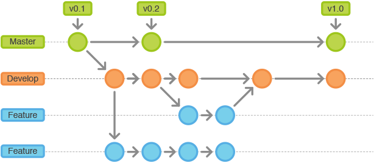

# Software Quality Management Plan

The purpose of this project is to demonstrate the best practices for a software development project. This document should only be used by the team as a reference guide for implementing the best practices during a project. The document will demonstrate the following topics:

- Scrum sprint backlog and task estimation

- Unit testing and Test-Driven development

- Test coverage metric

- Team version-control 

- Code-review checklist

## Scrum sprint backlog and task estimation

#### Sprint backlog
| Task                             				| Estimation    | Priority   |Status   |
| ----------------------------------------------|:-------------:|:----------:|:-------:|
| Create POJO's                    				| 1 			| 1          |Completed|
| Create Controller class          				| 1             | 2          |Completed|
| Investigate and configure test coverage tools | 2             | 3          |Completed|
| Create method to make new rubric 				| 2             | 4          |Completed|
| Create method to get a specific rubric by name| 2 			| 5          |Completed|
| Create method to create new student grade     | 2             | 6          |Completed|
| Create method to add a Criterion to a Rubric  | 2             | 7          |Completed|
| Create method to get a list of all Rubrics    | 2             | 8          |Completed|
| Create method to add a score for a particular criterion to a grade| 2             | 9          |Completed|
| Create method to get all StudentGrades associated with a specific rubric| 2             | 10          |Completed|
| Create method to find average score of all student grades in a rubric| 3             | 11          |Completed|
| Create method to find standard deviation of all student grades in a rubric| 3             | 12          |Completed|
| Create method to find the minimum and maximum scores in a rubric| 3             | 13         |Completed|
| Create method to find average score of all student grades in a specific criterion of a rubric.| 5             | 14         |Completed|
| Create method to find standard deviation of all student grades in a specific criterion of a rubric.|5             | 15      |Completed|
| Create method to find the minimum and maximum scores in a specific criterion of a rubric.| 5             | 16         |Completed|

To estimate the task in the sprint backlog I used story points. This is a popular technique used in agile development
that allows the developers to create an estimation of the difficulty involved in implementing a specific user story.
An estimation is chosen based on different factors that can alter the difficulty such as the complexity of the task,
the effort involved to complete the task and the use of repetition within the task. 

In order to decide the estimations for the corresponding tasks, Fibonacci sequence numbers were used. I used
the Fibonacci sequence as it allows for the estimates to be scaled proportionally as opposed to a linear number scale.
The Fibonacci scale looks like 1,2,3,5,8,13...etc as opposed to a linear scale of 1,2,3,4,5...etc 

When estimating a story point it is good practice to set a baseline for each one. A task with the lowest estimation 
should be set as a baseline, so in my case I used creating the POJOs as a baseline. I set this estimation as a 1 as it 
involves no risk, requires little effort in terms of complexity and is a highly repetitive task. I then based other task 
estimations of this in terms of complexity, repetition and risk required in comparison to the baseline. So for example the 
task 'Create method to make new rubric' was assigned a story point of 2 as I estimate that this involves a bit more effort and complexity and is not a repetitive task compared to creating POJOs. However it is not too difficult and therefore should not be given more than an estimation of 2. 

  
    
  This diagram illustrates the thought process behind assigning estimations to tasks 

#### Calculating velocity
Velocity is a metric used to measure the amount of work a Team can complete during a Sprint. By analyzing the amount of tasks completed in previous sprints, A development team can estimate how much work they can do in future sprint.
 
In order to estimate the Velocity the team should review the previous three sprints. The team should count how many user story points have been completed in each sprint, while disregarding any that may not be completed or partially completed. So for example in my sprint, if the team completed all tasks, a total of 37 story points would have been completed. This process would be completed for three sprints then add the total number of stories and divide it by three to get the average number of story points completed. The team can now plan future sprints around this velocity metric they have calculated. The amount of work in future sprints should be decided based on this. So the number of story points in a future sprint should be add up to a number around the velocity calculated. this will dictate how many user stories will be in the sprint. It is important to remember that this is only an estimate and can change depending on variables such as team size and project complexity. 
A useful way to keep track of velocity is by using a chart or graph to illustrate it. Kanban boards or velocity burndown graphs are a good option to illustrate the illustrate the planned velocity and compare it to the actual velocity. This gives teams a visual representation to help stay on track with the planned velocity of the sprint they are working on.

  
    
  This diagram illustrates an example of a burndown chart 

## Unit testing and Test-Driven development
test driven development is an approach to software development in which test cases are developed in conjunction to the code in order to help specify and validate what the code should do. When taking a test driven development approach to software development, tests should be developed for every bit of functionality within the application. The tests should should be run and if the code fails then the developer should write new code with the goal of improving it to pass the test.

This diagram highlights the process of test driven development. Before writing code the developer should create and design a test for the code they plan to write. With this test in mind the developer should then start to code the feature while trying to get this test to pass. At first they should only be focused on getting the tests passing. Regular testing on the feature being coded will help the developer to improve the code and get the test passing.Once it has passed a developer can then change the code to conform with best coding practices and refactor it to be more efficient while still testing to make sure it is still passing and working as designed. However as illustrated in the diagram, if the test fails the developer must make changes to the code and execute the tests again . This process repeats itself till the tests are working.

I took a test driven development approach to this project. as seen in this branch [here](https://github.com/DannyBrassil/SQAfinalAssignment/commits/ControllerClass), i make use of a large amount of tests. Each commit is a piece of functionality to the project which i used a test to get working. Once it worked i committed it to this branch and then updated my sprint backlog to mark the user story as 'Completed'. For example [this](https://github.com/DannyBrassil/SQAfinalAssignment/commit/fa363c6ba52848693ff1626d42a4761a5bf00150) commit shows the test class i created first. In order to get it working i had to create a method called averageGradesInCriterion(). In this case the test was very beneficial as it helped me see whether the calculation i was making was right or wrong which allowed me to work faster towards getting the right code. 

## Test Coverage metric 

Test coverage is a metric used in software testing that measures the amount of testing performed by a set of tests. It works by gathering information about which parts of the application are executed when running tests. The tool i used for my tests is called 
'EclEmma'. EclEmma is a java code coverage tool for eclipse. I chose this tool as it works good within the eclipse IDE and offers features within the IDE that allow for easy access to the analysis. It also provides plenty of analysis on the coverage and summarizes the coverage nicely and is highlighted throughout the code. 

To run this tool in eclipse you must first install it through the Eclipse Marketplace. When you go into the marketplace search for "EclEmma"
where it will then pop-up. Click on the install button and it will set itself up in your IDE. Once installed you run it by clicking on 'run' and then selecting 'Coverage as'. This will then run the tool on your application. This picture shows when the tool is running. It highlights the text being covered in tests in green and provides stats about the test coverage.

Here we can see that i have a line that is highlighted in red and therefore not being covered in any tests. I can close this gap by introducing a new method that will reach this line of code.

After introducing the new method and running the tool again you can see that this line of code is now covered in my tests as it is green. Similarly, The stats show an increase in the percentage coverage the my Controller.java class 

## Team version control
Team version control is the practice of tracking and managing changes to software code. A version control system is a software tool that aids a development team in implementing this practice. 

Gitflow is a branching model for Git. Git has become one of the most popular version control tools as it has many beneficial features. Git provides a long term history of changes.This is a very helpful for problems such as identifying the root causes of bugs or reverting back to older versions of the code. Git also provides branching and merging features these features allow team to work together on the same project without conflict. Team members can create a new branch to work on a new feature of the project without disrupting the current codebase. If they decide to add this new feature to the code Git allows them to merge it into the main branch that holds their code. Git also offers a high level of Traceability. Members of the team can trace all aspects of the changes made to the software. This helps with the managemnt of the project and also improves the knowledge of the team about the the project.  

I used the GitFlow process in this project. From my main branch I created a develop branch. This branch acted as a main branch in which all other feature branches were branched from and merged into. I kept track of my sprint backlog from the develop branch. For the tasks inside the sprint i created a new branch. for the setting up of the project i created a branch called "POJOs". I then created a branch called  "controller" for all of the the functionality for the application. This was beneficial as i could keep track of all my progress in terms of the sprint backlog all in one place. It also provides a history of my progress which was useful for when i needed to check back on certain commits. There was also other parts to this project such as investigating test coverage metrics and test driven development for example. For these other parts, because i was doing them at different stages throughout the project it was good idea to make these into separate feature branches. I could therefore work on these branches independently from the other code in the project.

This diagram illustrates the gitflow process that i followed. I had a master branch,which i then created a develop branch from. From that develop branch i created feature branches that had the content and functionality of the project. After finishing work on these i could then merge them back into the develop branch. Once the development was completed of the project i could then merge the develop back to the master branch as the project was finished.

## Code review
A code review is technique used in agile teams. Developers on a team review other developers code. The aim of this technique is to help the team grow. This happens as developers share knowledge with each other when doing reviews. It also helps mentor new engineers and teach them good practices. I used code reviews in my project before merging new features back into my develop branch. Whilst the unit tests ensure my code was correct, I used code reviews to analyse my code which helps ensure it is of a good standard. When conducting a code review, it is beneficial to use a code review checklist. A checklist helps guide develops on what to look for in code but it also ensures a standard is met within the codebase of a project. I followed a checklist while reviewing commits in my project which can he seen [here](https://github.com/DannyBrassil/SQAfinalAssignment/pulls?q=is%3Apr+is%3Aclosed) in a list. When providing feedback on the code review I leave comments such as [this](https://github.com/DannyBrassil/SQAfinalAssignment/pull/14).

#### Check List

**1. Code Formatting**
- Correct alignment of code
- Good naming conventions
- No unnessessary comments

**2. Coding best practices**
- No hardcoding 
- avoid large if/else blocks
- Use framework features when possible instead of writing custom code

**3. Architecture**
- Use design patterns where possible
- code follows same style as existing code base
- is code located in right files

**4. Maintainability**
- code should be self explanatory and easy to follow
- Easy to test
- should be easy to debug, use logs to help show flow of data in code
- should not have to be configured once it already has been

**5. Reusability**
- do not repeat code
- use reusable components such as functions

**6. Test coverage**
- Is the code tested enough.
- Do the current tests cover enough code.
- Is there any edge cases which haven't been catered for.

**7. Security**
- Is there any sensitive data in the code
- Is external data handled correctly
- Does it adhere to GDPR laws
- Is the correct encryption used for sensitive data

**8. Performance**
- will the code causes delays to the overall system
- will this affect other code it will work with
- can the performance be improved

**9. Scalability**
- How well can the code scale?
- code must be be to support a large user base that can grow
